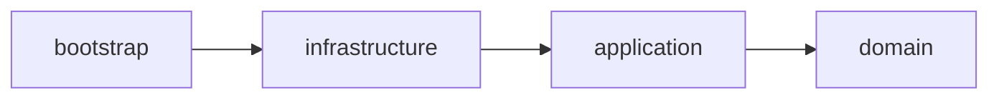
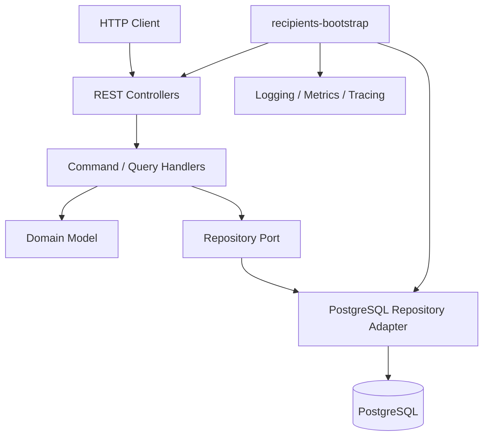

# Recipients Service


Backend service responsible for managing payment recipients associated with bank accounts.

The service is intentionally small, but engineered as a production-oriented bounded context. It uses DDD, CQRS, and hexagonal architecture to keep domain rules, use-case orchestration, persistence, HTTP adapters, and runtime wiring separated. The current implementation focuses on recipient creation, listing, removal, operational visibility, and failure handling around PostgreSQL-backed persistence.

The architecture exists to keep the domain model testable and independent while still using Spring Boot pragmatically where it improves delivery: HTTP adapters, validation, observability, database integration, and runtime configuration.

## Table of Contents

- [Why This Project Exists](#why-this-project-exists)
- [Tech Stack](#tech-stack)
- [Architecture](#architecture)
- [Features](#features)
- [Observability](#observability)
- [Running Locally](#running-locally)
- [Docker](#docker)
- [Kubernetes](#kubernetes)
- [Testing Strategy](#testing-strategy)
- [Configuration](#configuration)
- [Example API Requests](#example-api-requests)
- [Roadmap](#roadmap)
- [Engineering Notes](#engineering-notes)

## Why This Project Exists

This service is a focused backend system for practicing production-oriented engineering without hiding behind unnecessary platform complexity. It is used to explore backend architecture, operational readiness, observability-first design, and realistic testing practices in a bounded context that remains small enough to reason about.

## Tech Stack

| Area | Technology |
| --- | --- |
| Language | Java 25 |
| Framework | Spring Boot 4 |
| Persistence | PostgreSQL, Spring Data JPA, Hibernate |
| Database migrations | Liquibase |
| Build | Maven multi-module |
| Architecture | DDD, CQRS, Hexagonal Architecture |
| Runtime | Docker, Kubernetes manifests |
| Observability | Structured logging, Micrometer, OpenTelemetry |
| Metrics | Prometheus-compatible Micrometer metrics |
| Logs | JSON console logs, Grafana/Loki-compatible structure |
| Tracing | OpenTelemetry support through Spring Boot/Micrometer |
| Testing | JUnit 5, Mockito, Rest Assured, Testcontainers |
| Mutation testing | PIT |
| Concurrency | Virtual Threads in tests, Spring concurrency limiting |

## Architecture

The service is split into Maven modules with a single dependency rule: outer modules may depend on inner modules, but inner modules must not depend on outer modules. The domain module stays free of Spring and infrastructure concerns; framework usage is kept at the application, infrastructure, and bootstrap layers where it supports wiring, observability, persistence, and runtime behavior.

```text
recipients/
├── recipients-domain          # Aggregate, value objects, identities, domain exceptions, repository ports
├── recipients-application     # Command/query handlers, use-case orchestration, structured business events
├── recipients-infrastructure  # REST adapters, exception handlers, persistence adapters, JPA repositories
└── recipients-bootstrap       # Spring Boot runtime, configuration, Liquibase, Docker packaging
```





## Features

- Create recipients for a bank account.
- List recipients with pagination.
- Remove recipients.
- RFC 7807-style `ProblemDetail` error responses.
- Structured logs with stable event names.
- Correlation ID propagation through `X-Correlation-ID`.
- Micrometer metrics for HTTP and application use cases.
- Prometheus-compatible `/actuator/prometheus` endpoint.
- OpenTelemetry metrics/tracing support.
- Concurrency limiting for create/remove operations.
- PostgreSQL resilience handling for unavailable database scenarios.
- Kubernetes readiness/liveness probes.
- Docker multi-stage build with non-root runtime user.
- Testcontainers-backed integration tests.
- PIT mutation testing support for core/domain/application quality gates.

## Observability

### Structured Logging

Local logs are human-readable. Non-local profiles emit JSON logs to stdout using `logstash-logback-encoder`. Structured arguments and MDC values are included.

Important fields:

| Field | Purpose |
| --- | --- |
| `event_type` | Stable business event name, for example `recipients.create` |
| `outcome` | `success` or `failure` |
| `reason` | Normalized failure reason |
| `bank_account_id` | Bank account boundary identifier |
| `recipient_id` | Recipient identifier when available |
| `duration_ms` | Application use-case duration |
| `correlationId` | Request correlation ID from MDC |

Example JSON log:

```json
{
  "timestamp": "2026-05-06T19:30:12.440Z",
  "level": "INFO",
  "logger_name": "com.jcondotta.banking.recipients.application.recipient.command.create.CreateRecipientCommandHandler",
  "message": "Recipient created",
  "service": "recipients",
  "service_version": "1.0.0",
  "correlationId": "5d83107d-9e7f-46f2-99a7-6cf7c51cf319",
  "event_type": "recipients.create",
  "outcome": "success",
  "bank_account_id": "11111111-1111-1111-1111-111111111116",
  "recipient_id": "b96ac832-98cb-4590-bd42-0fa3a3ef61f6",
  "duration_ms": 28
}
```

### Metrics

The service exposes:

- JVM, process, disk, executor, and HikariCP metrics.
- HTTP server request metrics.
- Use-case metrics for `recipients.create`, `recipients.remove`, and `recipients.list`.
- Percentiles and histograms for selected latency metrics.

Example PromQL:

```promql
histogram_quantile(
  0.99,
  sum(rate(recipients_create_milliseconds_bucket[5m])) by (le)
)
```

```promql
sum(rate(http_server_requests_milliseconds_count{method="POST"}[5m])) by (uri, status)
```

```promql
histogram_quantile(
  0.95,
  sum(rate(http_server_requests_milliseconds_bucket{uri="/api/bank-accounts/{bank-account-id}/recipients"}[5m])) by (le)
)
```

### Loki / Grafana Compatibility

The application does not push directly to Loki. Logs are written to stdout in a structure that can be collected by Promtail, Grafana Alloy, Fluent Bit, or another log collector.

Example LogQL:

```logql
{application="recipients"} | json | event_type="recipients.create"
```

```logql
{application="recipients"} | json | outcome="failure"
```

```logql
{application="recipients"} | json | correlationId="5d83107d-9e7f-46f2-99a7-6cf7c51cf319"
```

### Cardinality Decisions

Metrics use low-cardinality tags such as `application`, `operation`, `aggregate`, `method`, `status`, and templated `uri`. High-cardinality values such as `recipient_id`, `bank_account_id`, and `correlationId` belong in logs and traces, not metric labels.

## Running Locally

### Prerequisites

- Java 25
- Maven 3.9+
- Docker / Docker Desktop
- PostgreSQL can be run through the provided Compose file

### Start Local Infrastructure

From the `recipients` directory:

```bash
docker compose -f docker/docker-compose.yml up -d
```

This starts:

- PostgreSQL on `127.0.0.1:5432`
- Grafana LGTM on:
  - Grafana: `http://localhost:3000`
  - OTLP HTTP: `http://localhost:4318`
  - OTLP gRPC: `http://localhost:4317`
  - Loki: `http://localhost:3100`

### Run the Application

```bash
mvn -pl recipients-bootstrap -am spring-boot:run \
  -Dspring-boot.run.profiles=local
```

Or run the main class from the IDE with:

```text
SPRING_PROFILES_ACTIVE=local
```

### Local Environment Defaults

`application-local.yml` expects:

```text
jdbc:postgresql://localhost:5432/recipients_db?connectTimeout=3&socketTimeout=5
username: admin
password: password
```

### Run Tests

Run unit tests:

```bash
mvn test
```

Run tests for this service:

```bash
mvn test -pl recipients-bootstrap -am
```

Run integration tests:

```bash
mvn verify -pl recipients-bootstrap -am
```

Run a specific integration test:

```bash
mvn test -pl recipients-bootstrap -am \
  -Dtest=RecipientResilienceIT \
  -Dsurefire.failIfNoSpecifiedTests=false
```

Run mutation testing for the domain module:

```bash
mvn pitest:mutationCoverage -pl recipients-domain
```

## Docker

The Docker image uses a multi-stage build:

1. Maven builder image compiles the root parent, core modules, and recipients service.
2. JRE runtime image runs only the packaged Spring Boot jar.

Runtime characteristics:

- Non-root user.
- Healthcheck against `/actuator/health`.
- G1GC.
- `ExitOnOutOfMemoryError`.
- `MaxRAMPercentage=75`.

Build from the monorepo root:

```bash
cd /Users/jcondotta/development/banking-system

docker build \
  -f recipients/recipients-bootstrap/Dockerfile \
  -t jcondotta/recipients:1.0.0 \
  .
```

Run locally:

```bash
docker run --rm \
  --name recipients \
  -p 8080:8080 \
  -e SPRING_PROFILES_ACTIVE=prod \
  -e SPRING_DATASOURCE_URL='jdbc:postgresql://host.docker.internal:5432/recipients_db?connectTimeout=3&socketTimeout=30' \
  -e SPRING_DATASOURCE_USERNAME=admin \
  -e SPRING_DATASOURCE_PASSWORD=password \
  jcondotta/recipients:1.0.0
```

Build and push a multi-architecture image:

```bash
docker buildx build \
  --platform linux/amd64,linux/arm64 \
  -f recipients/recipients-bootstrap/Dockerfile \
  -t jcondotta/recipients:1.0.0 \
  -t jcondotta/recipients:latest \
  --push \
  .
```

Inspect published platforms:

```bash
docker buildx imagetools inspect jcondotta/recipients:1.0.0
```

## Kubernetes

Kubernetes manifests are located under `k8s/application`.

The deployment includes:

- ConfigMap-driven application configuration.
- Secret-driven database credentials.
- Startup, readiness, and liveness probes.
- CPU and memory requests/limits.
- Non-root container configuration.
- Rolling update strategy.

Probe strategy:

```text
/actuator/health              -> startup
/actuator/health/readiness    -> traffic readiness
/actuator/health/liveness     -> process liveness
```

Apply manifests:

```bash
kubectl apply -f k8s/application/
```

Current tradeoffs:

- Liquibase currently runs inside the application process. The deployment is kept conservative while this remains true. For production, prefer a dedicated migration job or CI/CD migration step.
- OTLP export is disabled by default in Kubernetes config until an OpenTelemetry collector endpoint is available.
- The manifests are service-level manifests, not a complete platform setup.

## Testing Strategy

The test suite is split by architectural layer.

Domain tests validate value objects, aggregate behavior, domain exceptions, and invariants without Spring.

Application tests validate command/query handlers, logging behavior, repository interactions, and failure paths.

Infrastructure tests validate REST mappers, controllers, exception handlers, PostgreSQL repositories, and persistence mapping.

Integration tests use Spring Boot, Rest Assured, and Testcontainers. They cover HTTP flows, PostgreSQL behavior, database-unavailable resilience, and concurrency limiting.

Mutation testing is configured through PIT. Domain and application modules are expected to maintain high mutation confidence because they carry the core business behavior.

## Configuration

| Variable | Required | Default | Description |
| --- | --- | --- | --- |
| `SERVER_PORT` | No | `8080` | HTTP server port |
| `SPRING_PROFILES_ACTIVE` | No | none | Runtime profile, for example `local` or `prod` |
| `SPRING_DATASOURCE_URL` | Yes outside local | none | Full PostgreSQL JDBC URL |
| `SPRING_DATASOURCE_USERNAME` | Yes outside local | none | PostgreSQL username |
| `SPRING_DATASOURCE_PASSWORD` | Yes outside local | none | PostgreSQL password |
| `MANAGEMENT_OTLP_METRICS_EXPORT_ENABLED` | No | `false` | Enables OTLP metrics export |
| `MANAGEMENT_OTLP_METRICS_EXPORT_URL` | No | `http://localhost:4318/v1/metrics` | OTLP HTTP metrics endpoint |
| `app.concurrency.recipients.create.limit` | No | `5` | Concurrent create request limit |
| `app.concurrency.recipients.remove.limit` | No | `5` | Concurrent remove request limit |

Important Actuator endpoints:

```text
GET /actuator/health
GET /actuator/health/readiness
GET /actuator/health/liveness
GET /actuator/metrics
GET /actuator/prometheus
```

## Example API Requests

All API requests should include:

```text
X-API-Version: 1.0
X-Correlation-ID: <uuid>
```

If `X-Correlation-ID` is omitted, the service generates one and returns it in the response.

### Create Recipient

```bash
curl -i -X POST \
  'http://localhost:8080/api/bank-accounts/11111111-1111-1111-1111-111111111116/recipients' \
  -H 'Content-Type: application/json' \
  -H 'Accept: application/json' \
  -H 'X-API-Version: 1.0' \
  -H 'X-Correlation-ID: 5d83107d-9e7f-46f2-99a7-6cf7c51cf319' \
  -d '{
    "recipientName": "Jefferson Silva",
    "iban": "GB82WEST12345698765432"
  }'
```

Successful response:

```http
HTTP/1.1 201 Created
Location: /api/bank-accounts/11111111-1111-1111-1111-111111111116/recipients/b96ac832-98cb-4590-bd42-0fa3a3ef61f6
```

### List Recipients

```bash
curl -s \
  'http://localhost:8080/api/bank-accounts/11111111-1111-1111-1111-111111111116/recipients?page=0&size=10' \
  -H 'Accept: application/json' \
  -H 'X-API-Version: 1.0'
```

Example response:

```json
{
  "recipients": [
    {
      "recipientId": "b96ac832-98cb-4590-bd42-0fa3a3ef61f6",
      "recipientName": "Jefferson Silva",
      "maskedIban": "GB82************5432",
      "createdAt": "2026-05-06T19:30:12.440Z"
    }
  ],
  "page": 0,
  "size": 10,
  "totalElements": 1,
  "totalPages": 1,
  "hasNext": false,
  "hasPrevious": false
}
```

### Remove Recipient

```bash
curl -i -X DELETE \
  'http://localhost:8080/api/bank-accounts/11111111-1111-1111-1111-111111111116/recipients/b96ac832-98cb-4590-bd42-0fa3a3ef61f6' \
  -H 'X-API-Version: 1.0'
```

Successful response:

```http
HTTP/1.1 204 No Content
```

### ProblemDetail Example

```json
{
  "type": "https://api.jcondotta.com/problems/conflict",
  "title": "Resource already exists",
  "status": 409,
  "detail": "Recipient IBAN already exists",
  "instance": "/api/bank-accounts/11111111-1111-1111-1111-111111111116/recipients"
}
```

Database unavailable example:

```json
{
  "type": "https://api.jcondotta.com/problems/database-unavailable",
  "title": "Service Unavailable",
  "status": 503,
  "detail": "Database is temporarily unavailable",
  "instance": "/api/bank-accounts/11111111-1111-1111-1111-111111111116/recipients"
}
```

## Roadmap

### v1

- Keep recipient create/list/remove stable.
- Keep PostgreSQL-backed persistence and Liquibase migrations.
- Publish Docker image.
- Run in Kubernetes with health probes and externalized config.
- Keep observability focused on logs, metrics, and basic OTLP integration.

### v1.1

- Move database migrations out of the application startup path.
- Add dashboard and alert definitions for latency, error rate, DB availability, and Hikari pool pressure.
- Add documented operational runbooks for DB down and degraded dependency scenarios.
- Revisit JVM/container memory sizing after real load data.

### v2

- Add realistic timeout testing only after timeout behavior is explicitly designed.
- Introduce platform-level observability deployment: OpenTelemetry Collector, log collector, Prometheus, Grafana dashboards.
- Reassess whether application-layer Spring annotations should be moved behind explicit adapters if module portability becomes important.
- Add performance/load tests outside the application codebase.

## Engineering Notes

This service intentionally uses architecture boundaries without treating them as ceremony. The domain module is kept clean. The application layer uses selected framework annotations where they provide practical value: observability, component wiring, and concurrency limiting.

Observability was prioritized early because failure diagnosis is part of production readiness, not a post-release task. Logs carry high-cardinality diagnostic fields; metrics keep cardinality low and focus on latency, throughput, and operational pressure.

Complexity is intentionally limited. There is no direct Loki appender, no service mesh requirement, no custom tracing framework, and no broad exception translation layer beyond observed failure modes. The current design should remain small enough to maintain while still being serious enough to operate.
